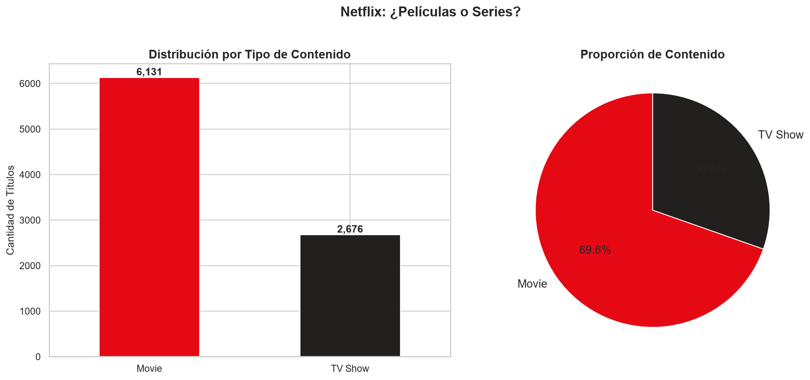
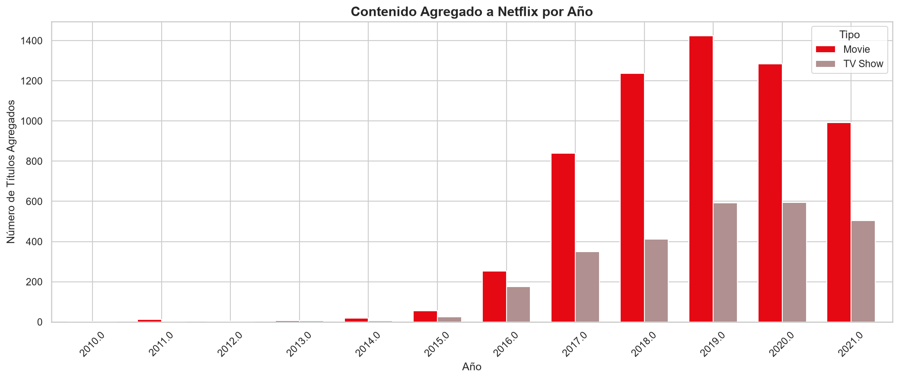
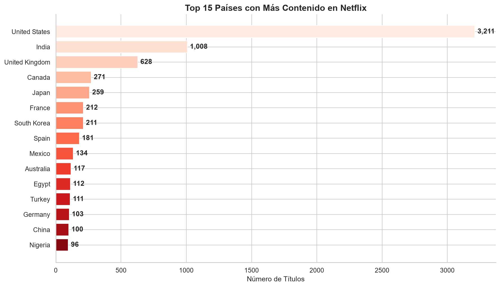
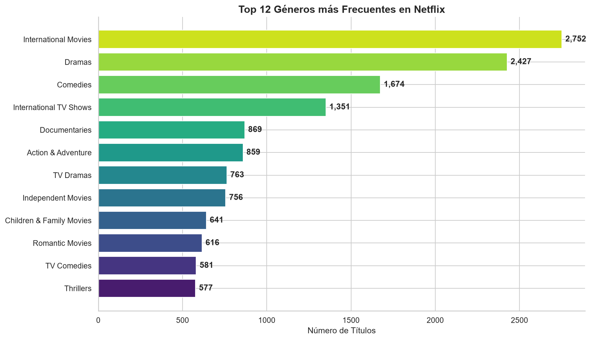
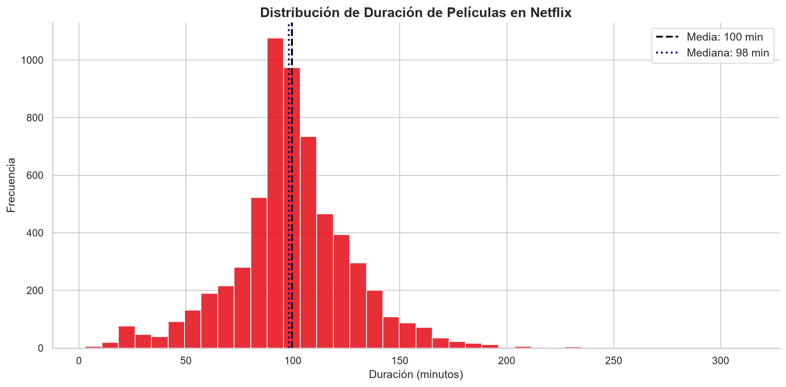
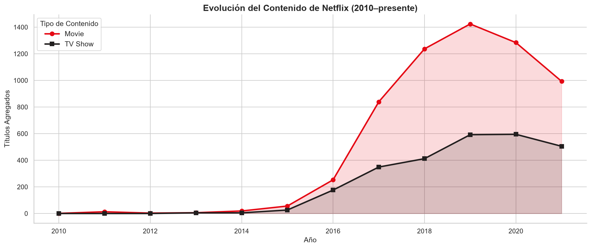

# 🎬 Análisis Exploratorio de Datos — Netflix Titles

> **Proyecto #1 de Portfolio | Analista de Datos**  
> Exploración del catálogo de Netflix para identificar patrones y tendencias mediante análisis visual de datos.


---

## 📌 Objetivo

Analizar el catálogo de Netflix (~8,800 títulos) para responder preguntas clave de negocio relacionadas con la distribución de contenido, tendencias temporales, geografía y géneros, utilizando Python y visualizaciones con matplotlib y seaborn.

---

## ❓ Preguntas de Negocio

| # | Pregunta |
|---|---|
| 1 | ¿Películas o Series — cuál domina el catálogo? |
| 2 | ¿En qué años Netflix agregó más contenido? |
| 3 | ¿Qué países producen más contenido disponible en Netflix? |
| 4 | ¿Cuáles son los géneros más frecuentes? |
| 5 | ¿Cuál es la duración promedio de las películas? |
| 6 | ¿Cómo ha evolucionado la producción de contenido a lo largo del tiempo? |

---

## 📊 Hallazgos Principales

### 1. ¿Películas o Series?
Las **películas dominan con el 69.6%** del catálogo (6,131 títulos), frente a 2,676 series de TV.



---

### 2. ¿En qué año Netflix agregó más contenido?
El **pico de adiciones fue en 2019** con más de 1,400 películas agregadas en ese año. A partir de 2020 se observa una desaceleración notable.



---

### 3. ¿Qué países producen más contenido?
**Estados Unidos lidera con 3,211 títulos**, casi el triple que India (1,008) en segundo lugar, seguido del Reino Unido (628). México aparece en el top 15 con 134 títulos.



---

### 4. ¿Cuáles son los géneros más populares?
**International Movies** es el género más frecuente con 2,752 títulos, seguido de **Dramas** (2,427) y **Comedies** (1,674). Esto refleja la estrategia global de Netflix de atraer audiencias internacionales.



---

### 5. ¿Cuánto duran las películas?
La duración promedio de las películas en Netflix es de **100 minutos** (mediana: 98 min). La distribución es aproximadamente normal con una ligera cola hacia la derecha.



---

### 6. Evolución del contenido a lo largo del tiempo
El catálogo creció de manera explosiva entre **2016 y 2019**, coincidiendo con la expansión global de la plataforma. Desde 2020 se observa una reducción en el ritmo de incorporación de nuevos títulos.



---

## 🔑 Resumen de Insights

| Pregunta | Hallazgo |
|---|---|
| ¿Películas o Series? | Las películas representan el **69.6%** del catálogo (6,131 títulos) |
| ¿Año con más adiciones? | **2019** fue el año récord de adiciones |
| ¿País con más contenido? | **Estados Unidos** con 3,211 títulos |
| ¿Género más popular? | **International Movies** con 2,752 títulos |
| ¿Duración promedio? | **100 minutos** por película (mediana: 98 min) |
| ¿Tendencia temporal? | Crecimiento explosivo 2016–2019, desaceleración desde 2020 |

---

## 🛠️ Tecnologías Utilizadas

| Herramienta | Uso |
|---|---|
| Python 3.9+ | Lenguaje principal |
| pandas | Manipulación y limpieza de datos |
| matplotlib | Visualizaciones base |
| seaborn | Visualizaciones estadísticas |
| Jupyter Notebook | Entorno de análisis interactivo |

---

## 📁 Estructura del Proyecto

```
01-netflix-eda/
├── data/
│   └── netflix_titles.csv          # Dataset original (Kaggle)
├── notebooks/
│   └── netflix_eda.ipynb           # Notebook completo con el análisis
├── images/
│   ├── 01_tipo_contenido.png
│   ├── 02_contenido_por_anio.png
│   ├── 03_top_paises.png
│   ├── 04_top_generos.png
│   ├── 05_duracion_peliculas.png
│   └── 06_evolucion_contenido.png
├── requirements.txt
└── README.md
```

---

## 📂 Dataset

- **Fuente:** [Netflix Movies and TV Shows — Kaggle](https://www.kaggle.com/datasets/shivamb/netflix-shows)
- **Registros:** ~8,807 títulos
- **Período:** 2008 – 2021
- **Columnas:** 12 (título, tipo, director, elenco, país, fecha de adición, año, clasificación, duración, géneros, descripción)

---

## ▶️ Cómo Ejecutar

1. Clona el repositorio:
   ```bash
   git clone https://github.com/iKmiloo/01-netflix-eda.git
   cd 01-netflix-eda
   ```

2. Instala las dependencias:
   ```bash
   pip install -r requirements.txt
   ```

3. Descarga el dataset desde [Kaggle](https://www.kaggle.com/datasets/shivamb/netflix-shows) y colócalo en la carpeta `data/` como `netflix_titles.csv`

4. Abre el notebook:
   ```bash
   jupyter notebook notebooks/netflix_eda.ipynb
   ```

---

## 👤 Autor

**Camilo Sanchez Vasquez**  
[](https://www.linkedin.com/in/camilo-sanchez-vasquez-6a89a5398/) · [](https://github.com/iKmiloo)
